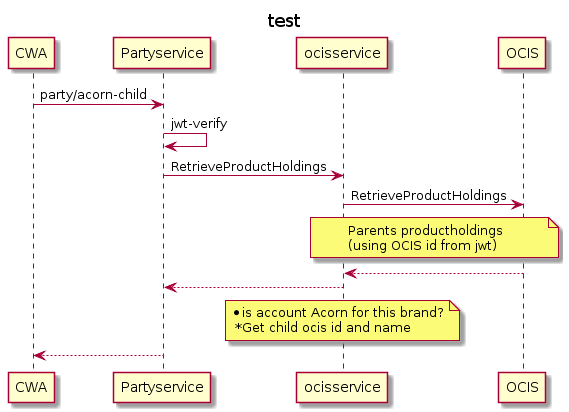

# PartyService


```
@startuml
CWA -> Partyservice: party/acorn-child
Partyservice->Partyservice: jwt-verify
Partyservice -> ocisservice:RetrieveProductHoldings
ocisservice -> OCIS:RetrieveProductHoldings
note over ocisservice , OCIS: Parents productholdings \n(using OCIS id from jwt)
OCIS --> ocisservice
ocisservice --> Partyservice
Partyservice -- xyz
note over ocisservice: * is account Acorn for  this brand? \n *Get child ocis id and name
Partyservice --> CWA
@enduml
```

